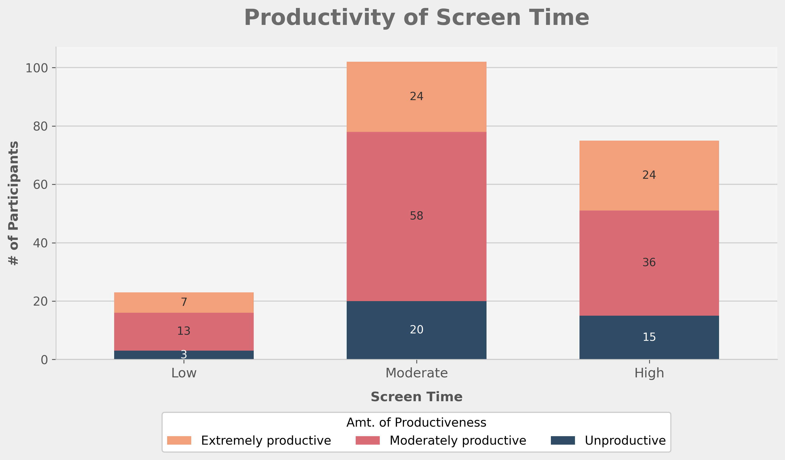
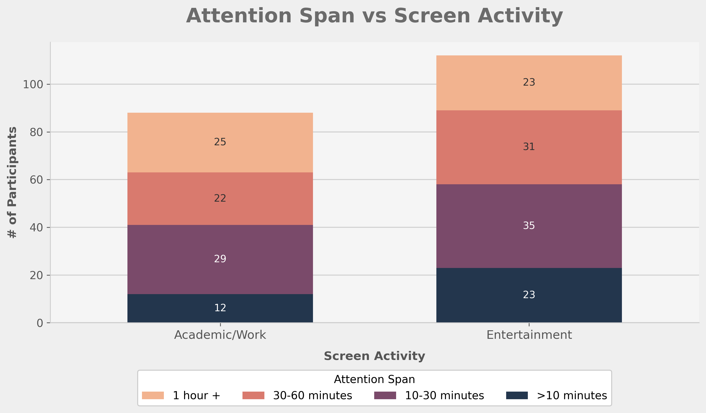
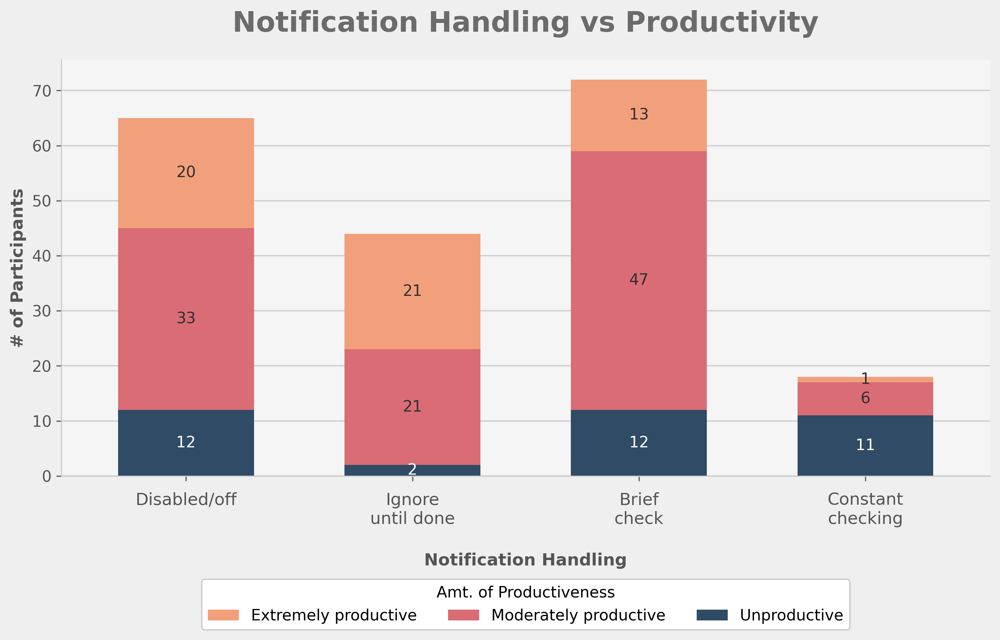
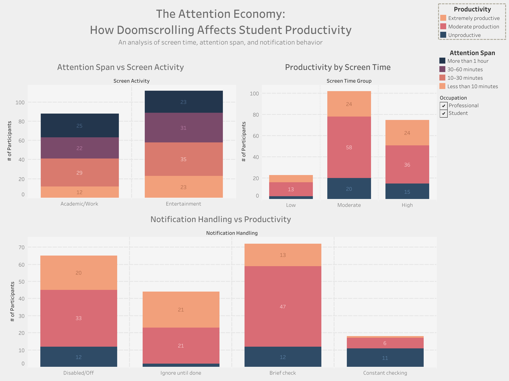

# The Attention Economy: How Doomscrolling Affects Student Productivity

A data-driven analysis exploring the relationship between screen time, digital behavior, and productivity using survey data, SQL data transformation, and Python visualization.

---

## 📋 Overview

This project explores how screen habits, digital behavior, and notification patterns relate to student productivity and attention span using survey-based data.

The goal of this project is to examine whether behaviors commonly associated with **doomscrolling** — such as extended screen time, entertainment-focused device use, and frequent notification interruptions — are linked to lower self-reported productivity and shorter attention spans.

From a behavioral economics perspective, this project frames **attention as a scarce resource**, where digital distractions may create opportunity costs that interfere with focused work and task completion.

---

## 🎯 Objective

This analysis investigates three core research questions:

* **Does higher screen time relate to lower productivity?**
* **Does the type of screen activity influence attention span?**
* **Do notification habits affect productivity outcomes?**

By examining these questions, the project aims to provide empirical insights into how digital behavior patterns may impact focus and work efficiency.

---

## 🛠️ Tools Used

This project was completed using:

* **SQLite** — data cleaning and transformation
* **Python (Pandas + Matplotlib)** — analysis and data visualization
* **Jupyter Notebook** — exploratory analysis and reporting
* **VS Code** — development environment
* **Tableau Public** — interactive dashboard design and presentation

---

## 📊 Dataset

**Source:** Kaggle - Screen Time, Productivity and Attention Span

- **Link:** https://www.kaggle.com/datasets/muhammadalirazazaidi/screen-time-data-productivity-and-attention-span
- **Records:** Survey responses from individuals across multiple demographics
- **License:** Publicly available for educational use

**Data Contents:**

The dataset contains survey responses related to:
- age group, gender, education level, occupation
- average screen time (categorized by ranges)
- device type (smartphone, laptop/PC, tablet)
- screen activity type (entertainment, academic/work-related)
- app categories (social media, streaming, productivity apps, etc.)
- time periods of usage (morning, afternoon, evening, late night)
- work environment (home, office, cafe, etc.)
- self-reported productivity levels
- attention span duration
- work strategies and notification handling behaviors

---

## 🧹 Data Cleaning Process

The raw dataset was cleaned and transformed using SQLite before analysis in Python.

**Cleaning Steps:**

1. **Variable Selection** — Selected relevant columns for analysis
2. **Text Formatting** — Trimmed inconsistent formatting and standardized categorical values
3. **Derived Variables** — Created `screen_time_group` categorical variable from numeric ranges:
   - **Low** → Less than 2 hours, 2–4 hours
   - **Moderate** → 4–6 hours, 6–8 hours
   - **High** → 8–10 hours, More than 10 hours
4. **Label Simplification** — Simplified categorical labels for clearer visualization and analysis
5. **Data Export** — Exported cleaned dataset as `screen_time_final.csv` for Python analysis

**Cleaning SQL:** See `sql/cleaning.sql` for the complete transformation pipeline.

---

## 📈 Key Visualizations

The cleaned dataset was analyzed in Python using **Pandas** and **Matplotlib**. Three main visualizations and one interactive dashboard were created:

### 1. Productivity by Screen Time



**Analysis:** This chart compares self-reported productivity levels across low, moderate, and high screen time groups.

**Key Insight:** Higher screen time groups appeared more likely to report lower productivity, suggesting a potential negative correlation between extended device use and work efficiency.

---

### 2. Attention Span vs Screen Activity Type



**Analysis:** This chart compares attention span duration across different types of screen activity (entertainment-focused vs. academic/work-related).

**Key Insight:** Attention span appeared to vary significantly based on activity type. Users engaged in academic or work-related screen activities generally reported longer attention spans compared to those primarily using devices for entertainment.

---

### 3. Notification Handling vs Productivity



**Analysis:** This chart examines the relationship between different notification-handling strategies and self-reported productivity levels.

**Key Insight:** Participants who disabled or ignored notifications appeared more likely to report stronger productivity outcomes, while those who frequently interacted with notifications reported lower productivity.

---

### 4. Interactive Tableau Dashboard



**Description:** The Tableau Public dashboard provides an interactive view of the key metrics and allows users to explore the data dynamically across multiple dimensions including demographics, device type, and usage patterns.

---

## 📁 Folder Structure

```
ATTENTION ECONOMY PROJECT/
│
├── data/
│   ├── cleaned/
│   │   └── screen_time_final.csv
│   ├── raw/
│   │   └── screen_time_survey.csv
│   └── attention_economy.db
│
├── notebooks/
│   ├── analysis.ipynb
│   └── test.ipynb
│
├── slides/
│
├── sql/
│   ├── analysis.sql
│   └── cleaning.sql
│
├── visuals/
│   ├── 1_productivity_of_screen_time.png
│   ├── 2_attention_span_vs_screen_activity.png
│   ├── 3_notifications_handling_vs_productivity.png
│   └── attention_economy_dashboard.png
│
├── LICENSE
├── README.md
├── requirements.txt
└── .gitignore
```

---

## 🔍 Key Findings

This analysis reveals three major patterns in the relationship between digital behavior and productivity:

### 1. Screen Time & Productivity Correlation
**Finding:** Individuals in the **high screen time group (8+ hours)** demonstrated significantly lower self-reported productivity compared to those with moderate or low screen time.

### 2. Activity Type Matters
**Finding:** The **type of screen activity** is a critical factor. Users engaged in **entertainment-focused activities** (social media, gaming, streaming) reported shorter attention spans and lower productivity, while **academic/work-related screen use** showed a more positive association with focus.

### 3. Notification Interruptions Impact Focus
**Finding:** Participants who **disabled or ignored notifications** reported meaningfully higher productivity levels. Those who **frequently checked notifications** during work showed lower productivity outcomes, supporting the theory that interruptions fragment attention.

### Behavioral Economics Interpretation
From a behavioral economics lens, these findings suggest that **attention is indeed a scarce resource**. Digital distractions create measurable opportunity costs by reducing the cognitive capacity individuals can allocate to primary tasks.

---

## 🚀 Future Improvements

Potential enhancements and extensions for this project:

1. **Time-Series Analysis**
   - Track changes in screen time and productivity over longer periods
   - Identify seasonal patterns in digital behavior

2. **Machine Learning Classification**
   - Build predictive models to forecast productivity levels based on screen activity
   - Implement clustering analysis to identify distinct user behavior segments

3. **Demographic Deep-Dive**
   - Analyze how digital behavior patterns differ across age groups, education levels, and occupations
   - Explore gender-based differences in screen time and productivity correlations

4. **Intervention Studies**
   - Design and test behavioral interventions (notification limits, app timers, etc.)
   - Measure impact on productivity and attention span over time

5. **Qualitative Research**
   - Conduct focus groups to understand the subjective experience of digital distraction
   - Explore user motivations for different notification-handling strategies

6. **Multi-Platform Analysis**
   - Integrate data from multiple devices to create a comprehensive screen time profile
   - Account for cross-device usage patterns (e.g., phone + laptop simultaneously)

7. **Longitudinal Study**
   - Follow participants over 6–12 months to assess causality vs. correlation
   - Track behavioral changes and productivity improvements over time

---

## 💻 How to Reproduce This Project

### Prerequisites
- Python 3.7 or higher
- Git
- SQLite (usually included with Python)

### Steps

**1. Clone the repository**

```bash
git clone https://github.com/moyaruizry-stack/attention-economy-project.git
cd attention-economy-project
```

**2. Install dependencies**

```bash
pip install -r requirements.txt
```

**3. (Optional) Rerun the SQL cleaning pipeline**

If you want to regenerate the cleaned data from the raw dataset:

```bash
sqlite3 data/attention_economy.db < sql/cleaning.sql
```

**4. Open the Jupyter Notebook**

```bash
jupyter notebook notebooks/analysis.ipynb
```

Then run the cells to explore the analysis and visualizations.

**5. View the data**

The cleaned dataset is located at:
```
data/cleaned/screen_time_final.csv
```

---

## 📋 Project Files Reference

### SQL Scripts
- `sql/cleaning.sql` — Data cleaning and transformation queries
- `sql/analysis.sql` — Analysis queries used to generate insights

### Jupyter Notebooks
- `notebooks/analysis.ipynb` — Main analysis and visualization notebook
- `notebooks/test.ipynb` — Testing and exploratory notebook

### Data Files
- `data/raw/screen_time_survey.csv` — Original dataset from Kaggle
- `data/cleaned/screen_time_final.csv` — Cleaned and transformed dataset
- `data/attention_economy.db` — SQLite database with cleaned data

### Visualizations
- `visuals/1_productivity_of_screen_time.png` — Screen time vs. productivity chart
- `visuals/2_attention_span_vs_screen_activity.png` — Activity type vs. attention span chart
- `visuals/3_notifications_handling_vs_productivity.png` — Notification handling vs. productivity chart
- `visuals/attention_economy_dashboard.png` — Interactive Tableau dashboard

---

## 📜 License & Attribution

### License
This project is licensed under the **MIT License**. See the `LICENSE` file for full details.

### Data Attribution
- **Dataset Source:** Kaggle - Screen Time, Productivity and Attention Span
- **Data Collection:** Survey-based data collected by dataset publisher
- **Privacy:** The dataset is anonymized with no personally identifiable information (PII)
- **Usage:** This project is for educational and analytical purposes only
- **Original Data Terms:** Users are responsible for adhering to the original dataset's terms of use from Kaggle

### Dependencies
All required Python packages are listed in `requirements.txt` and are open-source:
- **Pandas** — Data manipulation and analysis
- **Matplotlib** — Data visualization
- **Jupyter** — Interactive notebook environment

---

## 🔐 Ethical Considerations & Limitations

### Ethical Considerations
* Analysis is conducted at an **aggregated level** — individual-level data is not exposed
* **No causal claims** are made — findings represent correlations observed in survey responses
* Results are presented objectively without prescriptive claims about "correct" behavior
* Privacy is maintained through the use of anonymized survey data

### Limitations
* **Survey-based data** — Relies on self-reported measures of productivity and attention span
* **Cross-sectional data** — Represents a snapshot in time, not longitudinal trends
* **Correlation ≠ Causation** — High screen time and low productivity may be correlated, but causality cannot be inferred
* **Demographic bias** — Sample may not represent all user populations equally
* **Context missing** — Does not account for individual circumstances, job types, or personal circumstances

---

## 🤝 Contributing

Contributions, suggestions, and feedback are welcome! Please feel free to:
- Open an issue to report bugs or suggest improvements
- Submit pull requests with enhancements
- Share feedback on the analysis or findings

---

## 📧 Contact

For questions or inquiries about this project, please refer to the GitHub repository.

---

**Last Updated:** April 2026  
**Project Status:** Completed  
**License:** MIT
